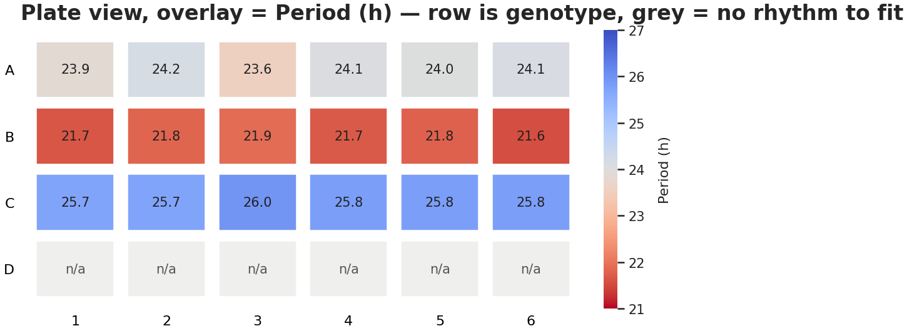

# Chronotopia

[](https://borfebor.github.io/chronotopia/)
[](RELEASE_NOTES.md)
[](LICENSE)

A browser-based application for analysing circadian time-course data. It handles
both short omics timecourses and long reporter recordings, from raw file to
publication-ready figure.

**[Documentation](https://borfebor.github.io/chronotopia/)** ·
**[Tutorials](https://borfebor.github.io/chronotopia/tutorials/)** ·
**[Release notes](RELEASE_NOTES.md)** ·
**[How to cite](#citing-chronotopia)**



<sub>Period estimated per well across a 24-well plate, one genotype per row.
Produced from the [long-series tutorial dataset](tutorials/) that ships with the
app.</sub>

---

## What it does

- **Preprocessing** — smoothing (rolling mean, Savitzky-Golay, DCT, resampling),
  normalisation, and detrending with six baseline estimators that you can either
  subtract or divide out. Entrainment windows can be excluded from everything
  downstream, so a driven rhythm is never mistaken for a clock.
- **Period estimation** — Lomb-Scargle, wavelet transform, FFT, autocorrelation,
  a damped cosinor that fits the decay rather than ignoring it, and a period
  sweep that shows the whole landscape instead of one number.
- **Rhythmicity testing** — MetaCycle (`meta2d`, JTK, ARS, LS) where R is
  available, plus a permutation cosinor and a random-forest classifier that need
  only Python. All FDR-corrected.
- **Feature extraction** — around 108 numbers per sample across nine packages,
  each one named, grouped by concept, and checked for redundancy before you use
  it, with a differential comparison across conditions.
- **Plate formats** — 6- to 384-well layouts detected automatically.
- **Export** — SVG figures with editable text, CSV tables, and PDF reports.

The [documentation](https://borfebor.github.io/chronotopia/) explains what each
choice costs you, not just what it does — see
[Preprocessing](https://borfebor.github.io/chronotopia/preprocessing/) for the
clearest example.

---

## Running it

### With Docker (recommended)

This is the only route that gives you MetaCycle, because the image installs R
and the MetaCycle package for you.

1. Install [Docker](https://www.docker.com/get-started) and make sure the daemon
   is running.

2. Clone, build and start:

   ```bash
   git clone https://github.com/borfebor/chronotopia.git
   cd chronotopia

   # -t names the image
   docker build -t chronotopia .

   docker run -p 8501:8501 chronotopia
   ```

3. Open <http://localhost:8501/> in your browser.

The first build takes a while — it compiles R and installs MetaCycle from
Bioconductor. Later builds reuse the cache.

### Without Docker

Python 3.11 or newer:

```bash
git clone https://github.com/borfebor/chronotopia.git
cd chronotopia

python -m venv .venv && source .venv/bin/activate   # Windows: .venv\Scripts\activate
pip install -r requirements.txt

streamlit run app.py
```

> **If `pip install` fails on rpy2**, you do not have R installed. `rpy2` builds
> against R's headers, so it cannot install without it. Either install R first,
> or drop the `rpy2` line from `requirements.txt` and continue — everything works
> except the MetaCycle methods, and the permutation cosinor and the random-forest
> classifier remain available for rhythmicity testing.

---

## Trying it without your own data

Two worked examples ship with the app, both with ground truth so you can check
that what you get back is right:

- **[Short series](https://borfebor.github.io/chronotopia/tutorials/short-series/)**
  — 48 h transcriptomics timecourse. Rhythmicity, phase, and why you should not
  ask this experiment for a period.
- **[Long series](https://borfebor.github.io/chronotopia/tutorials/long-series/)**
  — six days of luciferase across a 24-well plate. Trimming, entrainment,
  detrending and period estimation.

The data is in [`tutorials/`](tutorials/), and both carry deliberate mess —
replicate rows, a lost replicate, missing values, a medium-change transient,
baseline drift, damping — because real recordings do.

You can also generate a synthetic dataset with known properties from inside the
app, without uploading anything.

---

## Known limitations

Worth reading before you rely on a result. The current ones are listed in the
[release notes](RELEASE_NOTES.md#known-issues) and cover replicate handling in
three of the four period methods, the time-unit auto-guess for hourly data, and
how the QC flags behave after detrending.

---

## Citing Chronotopia

Please record the version — the numerical defaults change between releases, so
"Chronotopia" alone is not reproducible.

> Ferrero-Bordera, B. (2026). *Chronotopia: analysis of time-course data for
> circadian biology* (version 0.8.0). https://github.com/borfebor/chronotopia

Machine-readable metadata is in [`CITATION.cff`](CITATION.cff), and the
[citation guide](https://borfebor.github.io/chronotopia/reference/citing/)
explains what else to record for a reproducible methods section.

---

## Contributing

Bug reports and feature requests are welcome via
[GitHub issues](https://github.com/borfebor/chronotopia/issues). If you are
reporting a wrong number, please say which version you used and, if you can,
attach the file that produced it.

The repository carries its own checks: `verify.py`, `verify_stage1.py` and
`tutorials/verify_tutorial_data.py` assert that the documentation still matches
the code. They run in CI and should pass before a pull request is merged.

---

## Licence

Chronotopia is free software under the
[GNU General Public License v3 or later](LICENSE).

This is required rather than chosen: Chronotopia uses
[pyBOAT](https://github.com/tensionhead/pyBOAT) for its wavelet analysis, and
pyBOAT is GPL-3.0-or-later, so the combined work must be distributed under
compatible terms.

Copyright (C) 2026 Borja Ferrero-Bordera, Ludwig-Maximilians-Universität
München, and the John Innes Centre.
