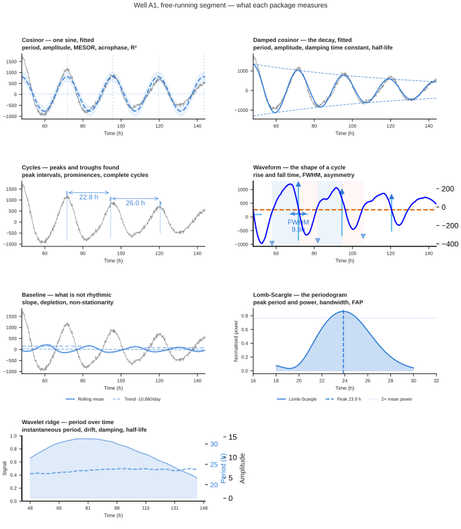
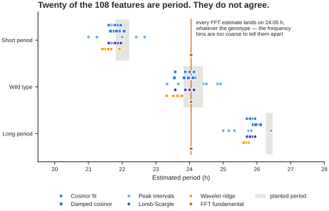
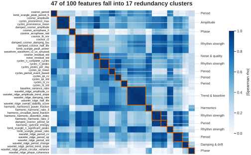
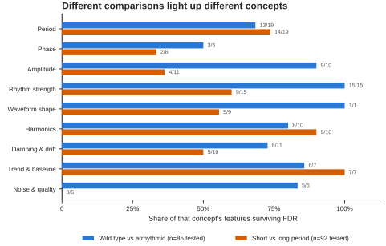

# Feature extraction

Most circadian tools give you a period and a p-value. Chronotopia gives you
**about a hundred numbers per sample**, each one named, described, and grouped by
what it actually measures — then the machinery to work out which of them you can
trust.

The extraction itself is the easy part. What makes it usable is everything
around it: a dictionary that says what each number means, a flag separating
biology from recording metadata, redundancy clustering so you know which
features are really the same measurement, a differential comparison that
corrects across the whole matrix rather than the one feature you happened to
look at, and per-sample context so a raw value becomes interpretable.

!!! info "The numbers on this page are real"

    Every figure and every count below comes from running the extractor over the
    [long-series tutorial dataset](tutorials/long-series.md) — 24 wells, four
    days of free-run, detrended. You can reproduce all of it, and CI checks that
    the page still matches the code.

---

## Nine packages, one pass

A package is a family of related measurements sharing a computation. Running one
sample through all nine costs a single pass over the trace.

Well A1 from the long-series tutorial, free-running segment. The overlays are
drawn by the extractor's own plotting methods, so this is the app's view rather
than an illustration.

| Package | What it does | Features |
|---|---|---|
| `cosinor` | Fits one sinusoid by least squares | 9 |
| `damped_cosinor` | Fits a sinusoid **with a decay term**, so damping is measured rather than removed | 8 |
| `waveform` | Geometry of an averaged cycle — rise, fall, width, asymmetry | 11 |
| `cycles` | Finds individual peaks and troughs, measures the intervals | 14 |
| `baseline` | The non-rhythmic part — slope, depletion, stationarity | 9 |
| `harmonic` | FFT spectrum: fundamental, 12 h and 8 h components, entropy | 10 |
| `noise` | Residual after the rhythm is removed; signal-to-noise, usable fraction | 9 |
| `lomb_scargle` | Periodogram peak, its power, width and false-alarm probability | 8 |
| `wavelet_ridge` | Instantaneous period and amplitude along the ridge, over time | 26 |

Plus four `meta_*` columns describing the recording itself. **108 features in
total** on a long recording.

!!! warning "Short recordings get 74 features, not 108"

    A recording of 48 h or less, or fewer than 20 points, is routed away from
    `wavelet_ridge` and `damped_cosinor` — you cannot track a ridge through two
    cycles, and a damped sinusoid has five free parameters that two cycles cannot
    separate. The [short-series tutorial](tutorials/short-series.md) data yields 74
    features rather than 108.

    This matters for a **mixed cohort**. If some samples are short and some are
    long, the wavelet features exist but are missing for the short ones, and
    that missingness correlates with recording length. Feed that to a
    classifier and it can score well by learning how long each sample was
    recorded for. The quality page below flags it.

## Ten concepts, and a role

The package tells you which code produced a number. The **concept** tells you
what it measures — which is what you actually want when you are deciding what to
report.

| Concept | Features | What it covers |
|---|---|---|
| **Period** | 20 | How long one cycle lasts, and how steady that is |
| **Rhythm strength** | 17 | How convincingly the trace oscillates at all |
| **Damping & drift** | 12 | Period drifting and amplitude damping across the run |
| **Amplitude** | 11 | How large the oscillation is, and how stable that size is |
| **Harmonics** | 10 | Energy at 12 h and 8 h, spectral complexity |
| **Noise & quality** | 10 | Residual noise, signal-to-noise, usable fraction |
| **Waveform shape** | 9 | Rise and fall times, width, asymmetry |
| **Trend & baseline** | 9 | Slope, depletion, non-stationarity |
| **Phase** | 6 | When in the cycle the peak falls |
| **Recording** | 4 | Duration, number of points, sampling interval |

Nothing falls through to "Other". Every one of the 108 features has a concept, a
one-line description, and a **role** — `biology` or `recording`.

### The role flag exists because of leakage

A hundred and four features describe the biology. Four describe the **recording**:
duration, number of points, sampling interval, and a short-series flag. They are
perfectly correlated with each other and useful for QC.

They are also a leakage risk. If your conditions happen to differ in how long
they were recorded — because one plate ran overnight and another did not — a
model given `meta_duration_h` can score well without ever looking at a rhythm.

Chronotopia **flags rather than drops**. Every column stays in the export; the
role is a label; the caller decides. The differential comparison and the feature
page both surface the role, so the decision is at least an informed one.

---

## Twenty features are period, and they disagree

This is the part worth internalising. Six independent estimators of period sit
in that concept, and they are not interchangeable.

Each dot is one well; the grey band is the range of periods actually planted in
that genotype. Most of the estimators recover the genotype ordering. One does not.

Error against the planted period, over the 18 rhythmic wells:

| Estimator | Feature | Median error | Worst well |
|---|---|---|---|
| Damped cosinor | `damped_cosinor_period` | 0.30 h | **0.47 h** |
| Cosinor fit | `cosinor_period` | 0.29 h | 0.63 h |
| Lomb-Scargle | `lomb_scargle_peak_period_h` | 0.29 h | 0.63 h |
| Peak intervals | `cycles_period_event_based` | 0.47 h | 1.47 h |
| Wavelet ridge | `wavelet_ridge_period_mean` | 0.61 h | 0.76 h |
| FFT fundamental | `harmonic_fundamental_period_h` | **1.97 h** | 2.42 h |

Read the two columns together. On the typical well the top three are
indistinguishable; where they differ is the **worst** well, and that is usually
what decides whether a genotype difference survives. The damped cosinor is the
only one of the six that writes the decay into the model instead of treating it as
noise, which is why its bad cases are less bad — a decaying rhythm broadens a
periodogram peak, and a broad peak is where the other estimators lose wells.

The FFT fundamental returns **24.05 h for every genotype** — short, wild type
and long alike. Over a 96 h window the FFT's frequency bins are ~1.4 h apart
near 24 h, so all three genotypes fall in the same bin. A reader who picked that
feature as "the period" would conclude the mutants are identical to wild type.

Nothing in the number itself tells you this. The dictionary tells you the six
are the same concept; comparing them tells you which to trust. **When the
estimators in a concept disagree, that disagreement is the result** — it is
telling you the recording does not constrain the quantity as well as a single
number suggests.

!!! tip "Features do not refuse"

    The six arrhythmic wells still produce a `cosinor_period` — around 20.4 h,
    fitted to noise. Every feature returns a number for every sample. Gate on
    the **Rhythm strength** concept (`cosinor_r2`, `lomb_scargle_fap`,
    `cycles_n_complete_cycles`) before believing anything in Period, Phase or
    Amplitude.

---

## Feature quality, before you use any of it

The **Feature quality** view answers three questions about the matrix you just
built, before you analyse it.

**What is constant?** On this dataset, 13 of the 108 features take a single
value across all 24 wells — `cosinor_p_value` and `lomb_scargle_fap` are floored
at zero for every well, the four `meta_*` columns are identical by construction,
and several booleans never vary. A constant column carries no information and
will silently break a correlation or a t-test. 95 features are usable.

**What is missing?** Eleven features have gaps. On a cohort of mixed recording
length that number climbs sharply, and the missingness is structural rather than
random — see the warning above.

**What is redundant?**

Absolute Spearman correlation among the clustered features, ordered by cluster.
Blocks outlined in orange are groups where every pair correlates at |rho| ≥ 0.95.

Forty-seven of the 108 features fall into **17 clusters**. Two of them hold six
features each. One is a rhythm-strength block — `cosinor_r2`, `cosinor_fit_snr`,
`lomb_scargle_peak_power`, `waveform_waveform_r2_vs_sinusoid` and both damping
measures — which on this data is one question ("is this trace a clean sinusoid?")
wearing six names. The other is a damping and baseline block from the wavelet
ridge.

That matters in two ways. Reporting six correlated features as six findings
overstates your evidence. And feeding all six to a model that assumes
independence — or ranking feature importances across them — will spread one
signal across six columns and make each look weak.

The clusters are computed on **your** data, not asserted in advance. Two features
that are redundant in a clean plate experiment may separate on noisier material.

---

## Comparing conditions, all features at once

The **Compare conditions** view runs every feature across two groups in one pass,
with the multiple-testing correction applied across the whole set.

Share of each concept's features that survive FDR correction, for two different
comparisons of the same 24 wells. Wild type against arrhythmic moves every
rhythm-strength feature; short against long period moves most of Period and both
acrophase features, while rhythm strength barely responds — those genotypes are
equally rhythmic, just at different periods.

---

## Where does one sample sit?

This is the **Sample Insights** view in the app.

A raw feature value is not interpretable on its own. Nobody knows whether
`baseline_depletion_index = 0.42` is normal. A percentile against the other
samples in the same experiment is interpretable immediately.

**Cohort context** gives, for a chosen sample, every feature's value, its
percentile within the cohort, the cohort median, and an extremity score. Asking
about well C3 in the tutorial plate returns its period features at the 98th
percentile — correct, since C3 is a long-period well among a plate that is mostly
not.

This is the view for "is this well odd, and in what way", which is a different
question from "do these two groups differ".

## Per-sample QC

**QC flags** applies five threshold rules and returns a verdict per sample with
the reasons attached, rather than a bare number:

| Rule | Fires when |
|---|---|
| Too few cycles | fewer than 2 complete cycles — period and amplitude are not estimable |
| Poor rhythm fit | `cosinor_r2` below 0.05 |
| Flat trace | dynamic range in the bottom 2% of the cohort |
| High noise | residual noise above the cohort's 95th percentile |
| Strong drift | more than half the variance is a monotonic trend |

!!! warning "Read the QC verdicts with care in v0.8.0"

    The rules are thresholds on raw-scale quantities, and on this dataset none
    of the three that fire identify the six wells that genuinely have no rhythm.

    - **The verdict flips depending on whether you detrended.** On raw traces
      every well trips *Strong drift*, because a decaying baseline is normal for
      a luciferase recording rather than a defect — 0 of 24 wells pass. On
      detrended traces *Strong drift* never fires, but *Flat trace* uses
      `(max − min) / |mean|`, and the mean of a detrended trace is near zero, so
      the ratio is dominated by that near-zero denominator. It ranks the
      arrhythmic wells as having *more* dynamic range than wild type.
    - **`cosinor_r2 < 0.05` is too lax** to catch the arrhythmic wells, which sit
      at 0.12–0.17.
    - **`cycles_n_complete_cycles`** counts peaks found in noise, so arrhythmic
      wells report 4–6 cycles while clean wild-type wells report 1–2.

    Use the Rhythm strength concept directly for now — `cosinor_r2` around 0.8
    versus 0.14 separates these groups cleanly. This is tracked in the
    [changelog](reference/changelog.md#known-issues).

Note that QC is about **trace quality**, not rhythmicity. An arrhythmic well is a
result, not a defect, and should not be flagged as one.

---

## Two more views that use the same model

Two entries in the plot picker share the random-forest classifier described under
[Rhythmicity testing](index.md), rather than the feature matrix on this page.

**Rhythmicity Model Evaluation** runs the classifier over every sample and breaks
the result down by verdict and confidence — `True high` through `False high` — so
you can see how much of a plate the model is confident about before you rely on
it. With a layout uploaded, one condition can be selected at a time.

**PCA** puts the raw traces through a standard-scaler and two principal
components, then colours each sample by that same classifier verdict and
confidence. It answers a different question from the volcano: not "which features
differ" but "do the samples separate at all, and does the model's opinion line up
with the separation". The axis labels carry the explained variance of each
component.

Neither view is a statistical test. Treat both as ways of looking at the
classifier's output, and gate anything you report on the tests above.

Every control in both is described in the
[control reference](reference/controls.md).

## Getting the numbers out

Everything on the Feature page exports as CSV: the full matrix, the data
dictionary (feature, concept, package, role, description), the quality report,
the redundancy clusters, and the comparison results with effect sizes and
q-values.

The dictionary is worth shipping alongside any analysis you publish. It is the
difference between a reviewer being able to check what `waveform_fwhm_relative`
means and having to guess.

## Where to go next

- [Tutorial 1](tutorials/short-series.md) uses the Phase and Amplitude concepts
  on a 13-timepoint omics series, where period is not recoverable.
- [Tutorial 2](tutorials/long-series.md) uses Period, Damping & drift and the
  plate overlays on a six-day reporter recording.
- [Citing Chronotopia](reference/citing.md) covers what to record in a methods
  section so a feature-based result can be repeated.
