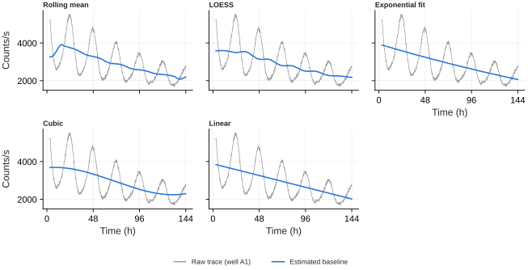
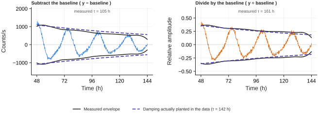

# Preprocessing

Everything on this page happens before a single period is estimated, and every
choice here changes the numbers that come out the other end. That is not a reason
to avoid it — an untreated baseline slide reads as damping that is not there — but
it is a reason to know what each option costs.

The short version: **detrending barely matters for period and matters enormously
for amplitude.** On the tutorial 2 dataset every combination of estimator and
removal mode recovers the planted period to the same 0.28 h. The same combinations
disagree by a factor of 1.7 about how fast the rhythm damps.

---

## The two decisions

Detrending is two separate choices that are easy to confuse:

**How the baseline is estimated** — the **Detrending** dropdown. A moving average,
a local regression, a fitted polynomial, an exponential. This decides what shape
the baseline is allowed to have.

**How the baseline is removed** — the **Baseline removal** radio. Subtract it, or
divide by it. This decides what kind of thing you think the baseline *is*.

The second choice is the one people skip, and on bioluminescence data it is the one
that matters more.

The same well, five estimators. The rolling mean and LOESS both track the decay
closely; the exponential is the only one with an asymptote, which is why it does
not bend at the ends, and the cubic curls back up in the last cycle because it has
none.

---

## Choosing an estimator

| | Use it when | Watch out for |
|---|---|---|
| **Rolling mean** | The default, and the most accurate in the interior of a recording — 0.7% error against a known baseline where LOESS gives 1.2%. | Its amplitude cost depends strongly on period, and a mid-run artefact spreads: a 6 h excursion moves the baseline by 16.8% *outside* the artefact. |
| **LOESS** | The safe general choice. A local line rather than a local mean, so it costs almost the same amplitude at any period in your range, holds its shape at the ends of a recording, and an artefact moves it 2.8% instead of 16.8%. | About 1 s per 96-well plate against 0.02 s for the rolling mean. The span must be well above the period — see below. |
| **Exponential fit** | Bioluminescence, where substrate consumption really is an exponential run-down. The fitted τ is a number you can report. | Assumes one monotonic decay. On a baseline that turns over it gives 3.3% error, and on a stepped one 6.1%. |
| **Linear** | A short recording with a gentle, obviously straight drift. | Almost never actually linear over several days — 5.3% on a non-monotonic baseline. |
| **Cubic** | A drift that clearly bends but has no obvious functional form. | No asymptote, so it curls up or down in the last cycle. Flexible enough to eat part of a long-period rhythm on a short recording. |
| **Rolling Hilbert** | Reading **period or phase** out of a visibly decaying trace. Removes a rolling mean and then divides by the signal envelope, flattening the rhythm to constant amplitude. | It removes exactly what you would measure if you were measuring damping. Use it for timing, never for amplitude. |

!!! warning "The rolling-mean window has to match the period"

    A centred moving average cancels *exactly* at period = window. Set the
    **Detrending window (h)** to the period you are measuring and the baseline
    goes while the rhythm survives at full amplitude. Move away from that and the
    cost is real and asymmetric:

    | Window | 20 h rhythm | 24 h rhythm | 28 h rhythm |
    |---|---|---|---|
    | 20 h | 1.000 | 0.809 | 0.652 |
    | 24 h | 1.156 | **1.000** | 0.839 |
    | 30 h | 1.212 | 1.180 | 1.066 |

    Windows longer than the period *overshoot* — the filter's response goes
    negative and the subtraction adds a phase-inverted copy back in.

    The window defaults to the middle of your **Period range** for this reason,
    and the caption under the slider reports the actual gain at both ends of that
    range. **No single window is right for samples of genuinely different period**,
    and that is the case for switching to LOESS.

!!! tip "The LOESS span has to be well above the period"

    The opposite failure. A local *line* fitted over one cycle follows the rhythm
    and removes it — at a span equal to the period only 57% of a 24 h oscillation
    survives. The span defaults to twice the period, which is where the cost stops
    depending on period at all:

    | Span | 20 h rhythm | 24 h rhythm | 28 h rhythm |
    |---|---|---|---|
    | 24 h | 0.724 | 0.571 | 0.452 |
    | 36 h | 1.032 | 0.912 | 0.782 |
    | 48 h | **1.076** | **1.072** | **1.005** |
    | 72 h | 0.987 | 1.015 | 1.061 |

    Compare the two tables. At its best window the rolling mean spans 0.652 to
    1.156 across a 20–28 h range; LOESS at a 48 h span spans 1.005 to 1.076. That
    flatness is the reason to prefer it whenever you are comparing amplitudes
    between samples whose periods differ.

## Subtract or divide

Subtract assumes the baseline is an **added offset**. Divide assumes it is a
**multiplying factor**, and returns the fractional deviation from it — still
centred on zero, so nothing downstream has to change.

For a bioluminescence or fluorescence reporter, the multiplicative reading is
usually the correct one. Substrate depletion, cell number and photobleaching scale
the whole signal, oscillation included. Subtract the baseline and the residual is
still multiplied by a falling one, so the rhythm looks like it is damping faster
than it is.

One well from tutorial 2, where the generator plants damping with τ = 142 h. The
solid black line is the measured envelope; the dashed line is the damping actually
present. Subtracting drops the envelope below what was planted. Dividing tracks it.

Across all 18 rhythmic wells, against a planted τ drawn from 120–165 h:

| Estimator | Subtract | Divide |
|---|---|---|
| Rolling mean | 94 h | **161 h** |
| LOESS | 89 h | **144 h** |
| Exponential fit | 92 h | **162 h** |
| Cubic | 93 h | **158 h** |

Dividing also recovers relative amplitude to within 5% of the planted value, and
preserves between-well amplitude differences far better (correlation with the
planted amplitude 0.93–0.97, against 0.78–0.80 for the subtractive methods).

!!! note "When Divide is refused"

    Division only means anything where the baseline stays positive. On data that
    has already been centred, z-scored or background-subtracted, the baseline
    passes through zero and the quotient explodes. The app detects this, says so,
    and subtracts instead. If you want divisive detrending, apply it to the raw
    positive signal and normalise afterwards, not before.

---

## Do's and don'ts

**Do trim before you detrend.** A medium-change transient at the start of a
recording is enormous, brief, and inside every window the baseline estimator
touches. Set **Starting Timepoint** past it first — it trims the recording for
every downstream calculation, not just the plot.

**Do set the window to the period, not to a habit.** See the table above.

**Don't detrend a short series just because you can.** Tutorial 1 is 13
timepoints. There is no baseline drift to remove there, and detrending costs more
signal than it recovers.

**Don't read trend or baseline features off a detrended trace.** You removed the
trend; `baseline_trend_r2` and its neighbours are now measuring what your
estimator left behind, not the biology.

**Don't trust the QC flags across the change either.** *Flat trace* uses
`(max − min) / |mean|`, and the mean of a detrended trace is near zero, so the
ratio is meaningless. On raw luciferase traces the opposite happens: every well
trips *Strong drift*, because a decaying baseline is normal there rather than a
defect.

**Don't use Rolling Hilbert and then report amplitude.** It divides the trace by
its own envelope, and removing amplitude structure is the whole point of it. Use it
to get period or phase out of a trace that is damping, and read amplitude from a
subtractive or divisive method instead.

**Don't compare amplitudes between samples whose periods differ, without checking
the window.** This is the subtle one. The caption under the slider tells you the
size of the effect.

**Do leave Normalization at None for period work.** Z-score is for overlaying
wells with very different absolute signal on one axis. Anything other than Global
Min-Max destroys between-sample amplitude comparisons on its own.

---

## Missing data

Every detrending method leaves gaps as gaps. A missing timepoint stays missing in
the output, does not spread into the points around it, and never affects another
sample — the fit or filter runs on the points that are there and the gaps are put
back afterwards.

You do not need to interpolate or drop incomplete wells before detrending. If a
well has so many gaps that the baseline cannot be identified, that is reported
rather than silently returning an empty column.

---

## Smoothing is a different thing

Smoothing removes point-to-point noise; detrending removes slow baseline
behaviour. They are separate controls and they compose.

**Savitzky-Golay** is the one to reach for if you are measuring amplitude or
waveform shape — it fits a local polynomial, so it preserves peak height and width
where a plain moving average flattens them. A 6 h window keeps a 24 h rhythm at
99.8% and its 12 h harmonic at 97%, while cutting white noise to about 40%. Above
roughly 12 h the harmonic starts to go.

If amplitude and waveform *are* the measurement, the honest option is **None** —
handle the noise in the model rather than in the trace.

---

Every control named on this page is also listed, with the exact text the app shows
in its tooltip, in the [control reference](controls.md).
