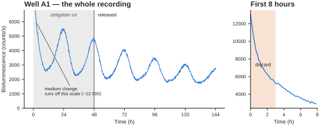
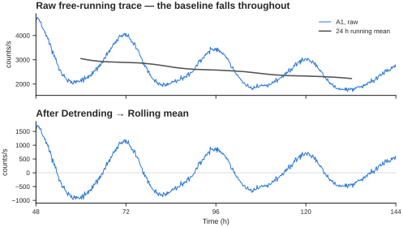
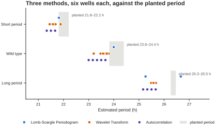
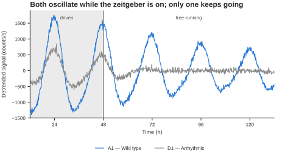
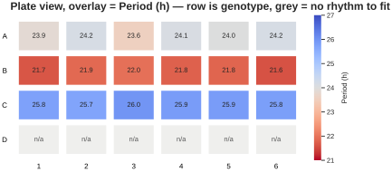
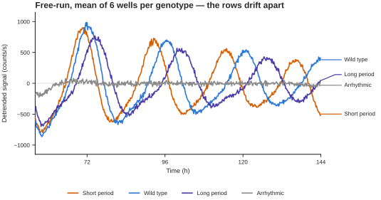

# Tutorial 2 · A long time series

[:material-file-delimited: Data](../downloads/tutorial_2_long_series_luciferase.csv)
[:material-file-delimited: Layout](../downloads/tutorial_2_long_series_layout.csv)
[:material-lightbulb-on: Entrainment](../downloads/tutorial_2_long_series_entrainment.csv)
[:material-file-check: Answers](../downloads/tutorial_2_long_series_truth.csv)

A bioluminescence recording: a PER2::LUC reporter in a 24-well plate, read every
10 minutes for six days. Two days under a 12:12 temperature cycle, then release
into constant conditions for four days.

Where [Tutorial 1](short-series.md) was about *not* asking for a period, this
one is about getting a good one — and about the three things standing between
you and it: a medium-change artefact at the start, a baseline that decays all
the way through, and an oscillation that damps as the cells desynchronise.

---

## What is in the file

| Property | Value |
|---|---|
| Time | 0 to 144 h, every 10 min — 865 timepoints |
| Wells | 24, named `A1`–`D6` |
| Units | photon counts per second |
| Zeitgeber | 12:12 cycle for the first 48 h, then constant |

One genotype per plate row:

| Row | Condition | Intrinsic period |
|---|---|---|
| A | Wild type | 24.2 h |
| B | Short period | 22.1 h |
| C | Long period | 26.4 h |
| D | Arrhythmic | none — damps out within a cycle of release |

Every well is slightly different, as they would be: periods are jittered by
about 0.2 h, and each well has its own baseline, decay rate and damping rate.
The answers file has the exact value for every one.

---

## Step 1 — load it

Upload the data file and set **Time column** to `Time`.

This time the unit guess is right — the 10-minute interval is 0.167 in the file,
below 1, so Chronotopia correctly assumes hours:

> Experiment with 24 sample recorded for 144.0 hours (recorded every = 0.2 h)

You should also see, in the layout popover:

> :material-grid: Detected a 24-well (4×6) plate from the sample names (24/24 wells identified).

That came from the well names alone. It unlocks the **Plate view** and the
option to group wells by row or column.

## Step 2 — group the wells, two ways

**The quick way.** In the layout popover, set **Group wells by** to `Row`. On
this plate, row *is* genotype, so you get four groups without uploading
anything.

**The proper way.** Upload the layout file. Same four groups, but now named —
*Wild type*, *Short period*, *Long period*, *Arrhythmic* — which is what you
want on a figure legend. An uploaded layout always wins over geometric grouping.

Use the layout file. The geometry shortcut is there for when your plate genuinely
is organised by row and you are just looking.

## Step 3 — trim the medium change

Left: the whole recording, shaded where the zeitgeber is on. Right: the first
eight hours on their own scale — the trace starts near 12 000 counts and has
fallen by more than half within an hour.

That opening spike is the medium change, not biology. Fresh medium, a
temperature step, a mechanically disturbed monolayer — every luciferase
recording starts with one, and it is always discarded. Left in, it dominates
every detrending window it touches and pulls the first cycle out of shape.

Set **Starting Timepoint** to **3** hours. The transient is a sub-hour
exponential, so 3 h clears it with room to spare while costing almost nothing.

!!! tip

    Look at the first hour of every recording before you analyse it. This is a
    habit worth forming, not a quirk of this dataset.

## Step 4 — tell the app about the entrainment

Open **Entrainment parameters**. There are three ways to describe the 12:12
cycle; all three give the same answer here.

=== "Manual"

    Set *Entrainment cycles* to `2`, *T cycle* to `24`, day length `12`. Fine
    when you know the protocol.

=== "Upload"

    Set **Mode** to `upload` and give it the entrainment file. It is two columns
    — time, and a 0/1 zeitgeber state — and Chronotopia reads the *last* column
    as the signal, counting rising edges.

    This file starts in the cold half precisely so that both cycles produce a
    rising edge; a schedule that starts warm would be read as one cycle, not
    two. It resolves to 2 cycles of 24 h, putting the release at hour 48.

=== "From data"

    Only useful when you have recorded the zeitgeber as one of the columns in
    the data file itself.

Set **Zeitgeber type** to `Cold - Warm`, and the entrained portion is shaded on
every plot from here on.

Leave **Exclude entrainment from period estimation** switched on. This is the
control that matters. During the first 48 h every well is being driven at 24 h
by the cycle, so including that stretch pulls every period estimate towards 24 —
erasing exactly the genotype differences you are trying to measure. With it on,
period estimation runs on hours 48–144 only.

## Step 5 — remove the baseline

The oscillation is obvious in the raw trace, but it rides on a baseline that
falls from roughly 3 900 to 2 200 counts as the substrate is consumed. A 24 h
running mean tracks that baseline; subtracting it leaves the rhythm centred on
zero.

That drift is not a rhythm, but every frequency method treats it as very
low-frequency power. Set **Detrending** to **Rolling mean** and leave
**Detrending window (h)** where it lands — it defaults to the middle of your
Period range, which is what a moving average needs in order to remove the
baseline without eating into the rhythm.

Leave **Baseline removal** on *Subtract* for now. Switching it to *Divide* is the
right call if you are going to report amplitude or damping from these traces, and
[Preprocessing](../reference/preprocessing.md) explains why: the baseline here is
a multiplying factor, so subtracting it leaves the rhythm looking like it damps
about 1.5x faster than it does.

The gain on period is modest here — Lomb-Scargle's worst well moves from 1.20 h
off the planted value to 1.15 h — because Lomb-Scargle is fairly robust to a
smooth trend and the free-running window is short enough that the decay within
it is nearly linear. It matters much more on the actogram and on the amplitude
features, where an untreated baseline slide reads as damping that is not there.

!!! note "Rolling Hilbert removes the damping too"

    *Rolling Hilbert* goes one step further and divides out the amplitude
    envelope. That is the right choice when you care about **phase** and want
    the damping gone entirely — and the wrong choice when damping is what you
    are measuring, since it removes exactly the thing you want.

Leave **Normalization** at *None* for period work. Switch it to *Z-Score* when
you want to overlay wells with very different absolute signal on one axis.

## Step 6 — estimate the period

Set **Period range** to something generous — 16 to 32 h — and work through the
methods.

Each dot is one well. The grey band is the range of periods actually planted in
that genotype's six wells. All three methods sit slightly low, and all three
separate the genotypes far more cleanly than they pin an absolute value.

| Method | Short period | Wild type | Long period | median error |
|---|---|---|---|---|
| **planted** | **22.1** | **24.2** | **26.4** | — |
| Lomb-Scargle Periodogram | 21.8 | 24.0 | 25.5 | 0.35 h |
| Wavelet Transform | 21.6 | 23.5 | 25.6 | 0.67 h |
| Autocorrelation | 21.4 | 23.3 | 25.4 | 0.83 h |

Three things to read off that.

**Every method gets the biology right.** Short < wild type < long, every time,
with the genotypes separated by about 2 h — several times the disagreement
between methods.

**No method is exact.** The worst individual well is off by 0.9 to 1.2 h
depending on the method, and the methods disagree with each other by up to 0.7 h
on the same wells. Four cycles of a damping oscillation is not enough to do
better.

**So report the difference, not the absolute number.** "The mutant runs 2.2 h
shorter than wild type" is supported by this recording. "The mutant period is
21.8 h" is a number with about an hour of method-dependent slop that you have
not quoted. If you do quote an absolute period, say which method produced it.

!!! warning "Lomb-Scargle's frequency grid is coarse at long periods"

    `autopower()` runs at astropy's default resolution, which over a 96 h window
    puts consecutive candidate periods about 1.4 h apart near 26 h. Long periods
    therefore come back quantised — you will see repeated identical values
    across wells. That is a resolution limit of the grid, not agreement between
    wells.

**Period sweep** is worth a look too. Instead of one number per well it scans a
range and shows how sharply the fit peaks. A well with a broad, flat sweep is
telling you its period is poorly determined, which no single number does.

## Step 7 — find the arrhythmic wells

Row D has no self-sustained clock. During entrainment those wells still
oscillate — they are being driven by the temperature cycle, and a driven
response looks a lot like a rhythm.

A1 and D1 both oscillate while the zeitgeber is on. Within about a day of
release, only one of them is still going.

This is why step 4 matters. Test for rhythmicity across the whole recording and
row D will pass, on the strength of the driven cycles alone.

Set **Rhythmicity Analysis Parameters → Minimum time** to `48` so the test runs
on free-running data only. Now the four rows separate cleanly: over the last two
days, the rhythmic wells' fitted amplitude is 4.4 to 7.3 times their residual
scatter, and row D's is 0.08 to 0.28. Not marginal — absent.

## Step 8 — the plate view

The overlay is a diverging scale centred on 24 h, so shorter and longer read as
opposite directions from a neutral midpoint. The four genotype rows are visible
at a glance, and row D — where the cosinor has no rhythm to fit — greys out.

Switch the plot to **Plate view** and set **Overlay** to `Period (h)`. Try
`Cosinor R²` as well; row D drops out. `Rhythmicity` appears in the list once
you have run an analysis and gives the verdict per well.

This is the fastest QC you have on a plate experiment. An edge well that dried
out, a well that never got cells, a row you pipetted wrong — all of them show up
here in one glance and in no other view.

## Step 9 — compare the conditions

Mean of six wells per genotype, detrended, after release. They start in phase —
the zeitgeber held them there — and by day six the short-period row is roughly
half a cycle ahead of the long-period one. That divergence is the period
difference made visible, and it is more convincing than any table.

**Compare conditions** with all four groups, style *Mean ± SD*, with the plot
starting after release. Underneath it is an expander listing every trace's
estimated period using whichever method you selected — handy for spotting a
single odd well.

Then **Feature extraction → Compare conditions**, which runs all ~100 features
across the groups at once, grouped by concept. Compare *Short period* against
*Long period* and the **Period** concept should dominate; compare either against
*Arrhythmic* and **Rhythm strength**, **Amplitude** and **Damping & drift** take
over.

!!! note "Watch the Recording concept"

    It should stay flat in every comparison — it describes duration and
    sampling, which are identical across all 24 wells. If Recording ever comes
    out significant in your own data, that is a warning, not a result: your
    groups differ in how long they were recorded, and any model you train will
    be able to cheat.

---

## Check your work

The answers file gives, per well: the intrinsic period, the initial relative
amplitude, the baseline decay constant, and whether the well is rhythmic after
release.

You have driven the app correctly if:

- every rhythmic well's period is within ~1.5 h of `True_intrinsic_period_h`
- the three genotype means are ordered short < wild type < long
- all six row D wells come back arrhythmic **when tested after hour 48**

## What to take away

1. **Trim the start.** Every reporter recording opens with an artefact.
2. **Exclude the entrainment** before estimating period, or you will measure the
   zeitgeber instead of the clock.
3. **Detrend.** The baseline decays for the whole recording, and every frequency
   method reads that as signal.
4. **Report differences, not absolutes.** Methods agree on the comparison and
   disagree by up to an hour on the number.
5. **A driven rhythm is not a clock.** Test after release, not across the whole
   recording.

## A note on 96-well plates

This tutorial uses 24 wells to keep it responsive. Everything here works the
same on 6, 12, 48, 96 and 384-well plates; Chronotopia reads the format from the
well names. A 96-well plate at 10-minute sampling takes noticeably longer on the
wavelet method, so do your exploratory passes with Lomb-Scargle and switch to
wavelet for the final numbers.
