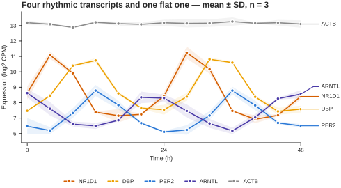
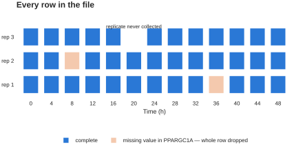
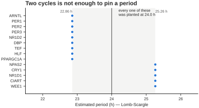
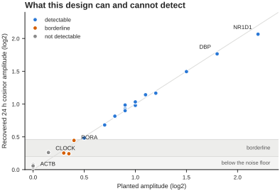
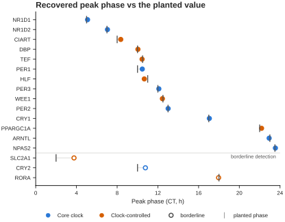

# Tutorial 1 · A short time series

<div class="ct-downloads" markdown>
[:material-file-delimited: Data](../downloads/tutorial_1_short_series_omics.csv)
[:material-file-delimited: Layout](../downloads/tutorial_1_short_series_layout.csv)
[:material-file-check: Answers](../downloads/tutorial_1_short_series_truth.csv)
</div>

This is the shape of experiment you get from transcriptomics or proteomics: a
handful of timepoints, a few replicates each, and a lot of measured variables.
Mouse liver, released into constant darkness, sampled every 4 h for 48 h, three
biological replicates per timepoint. 24 transcripts, in log2 CPM.

The headline: **48 h of 4-hourly data will not tell you a period.** It will tell
you, quite reliably, *which* transcripts are rhythmic and *when* they peak. Most
of this tutorial is about not asking the data the question it cannot answer.

---

## What is in the file

| Property | Value |
|---|---|
| Time | 0 to 48 h, every 4 h — 13 timepoints |
| Rows | 38 — three replicates per timepoint, with one exception |
| Columns | 24 transcripts |
| Deliberately awkward | one timepoint has only 2 replicates; one transcript has 2 missing values |

Three groups, set in the layout file:

- **Core clock** (10) — ARNTL, CLOCK, NPAS2, PER1–3, CRY1–2, NR1D1, NR1D2
- **Clock-controlled** (8) — DBP, TEF, HLF, CIART, RORA, WEE1, SLC2A1, PPARGC1A
- **Non-rhythmic** (6) — ACTB, GAPDH, TUBB, RPL13A, B2M, HPRT1



<p class="figure-caption" markdown>
What you are working with. NR1D1 is the largest rhythm in the file; ARNTL peaks
nearly opposite it; ACTB is a housekeeping gene doing nothing, which is exactly
what it should do. Bands are ±SD across the three replicates.
</p>

---

## Step 1 — load it, and fix the time unit

Upload the data file in the sidebar. Set **Time column** to `Time`.

Now look at **Time unit**. It will say **Minutes**. That is wrong — change it to
**Hours**.

!!! danger "Why the guess is wrong here"

    Chronotopia infers the unit from the size of the sampling interval: anything
    above 1 is assumed to be minutes, because most raw recordings are. A
    4-hourly omics series already in hours looks exactly like a 4-minute
    recording to that rule.

    Check the header line under *Data Preview*. With Hours selected it reads:

    > Experiment with 24 sample recorded for 48.0 hours (recorded every = 4.0 h)

    If it says 0.8 hours, the unit is still wrong.

## Step 2 — attach the layout

Open **Upload experimental layout** and upload the layout file. It has the two
columns Chronotopia needs:

```csv
Sample,Condition
ARNTL,Core clock
CLOCK,Core clock
...
```

Your samples are now labelled `Core clock - [ARNTL]` and so on, and four grouped
views appear that were not there before: **Lineplot [Mean ± SD]**, **Lineplot
[Mean + Replicates]**, **Compare conditions**, and the condition-aware parts of
the Feature page.

## Step 3 — deal with the missing values first

PPARGC1A has two unquantified timepoints — a low-abundance transcript that did
not clear the detection threshold in two samples. Real omics matrices are full
of these.



<p class="figure-caption" markdown>
Every row in the file. The gap at 20 h is a replicate that was never collected.
The two orange cells are PPARGC1A's missing values — and because Chronotopia
drops any row containing a missing value, those two cells cost two whole
timepoint-replicates **for every transcript in the file**, not just PPARGC1A.
</p>

Two of your 38 rows disappear. You have two options, and this tutorial is
agnostic about which is right:

- **Keep PPARGC1A** and accept 36 rows. Fine here — you still have 13
  timepoints, one of which is down to two replicates.
- **Drop PPARGC1A** via *Exclude samples from data* in the sidebar, and keep all
  38 rows for the other 23 transcripts.

The point is to make the choice knowingly. A silent row drop is the kind of
thing that quietly changes an FDR threshold later.

## Step 4 — look at the data before testing it

Set the plot to **Lineplot [Mean ± SD]** and pick the three conditions. The
*Core clock* and *Clock-controlled* groups should oscillate with roughly one
peak per day, and the *Non-rhythmic* group should sit flat with error bars small
enough to see the difference.

Now switch to a plain **Lineplot** and step through individual transcripts. Two
worth stopping on:

- **NR1D1** — the largest rhythm in the file, peaking around CT5.
- **CLOCK** — a real rhythm, but a tiny one. It will look like noise. Hold that
  thought until step 6.

Leave **Normalization** and **Detrending** at *None*. There is no baseline drift
in this experiment to remove, and detrending 13 timepoints costs more signal
than it buys.

## Step 5 — do not ask for a period

You have 48 h of data. Two cycles. Whatever you set **Period Estimation** to,
the answer carries a couple of hours of uncertainty, because a two-cycle record
does not constrain a frequency any better than that.



<p class="figure-caption" markdown>
Lomb-Scargle on the 14 clearly-rhythmic transcripts. Every one was planted at
exactly 24.0 h. The estimates land in two clusters two and a half hours apart —
and the clustering is itself informative: Lomb-Scargle's frequency grid is
coarse enough over a 48 h window that only a few candidate periods exist at all.
That is not a fault in the estimator. It is what two cycles is worth.
</p>

**Do not report a period from this dataset.** If period is the question you came
with, you need a longer recording — which is what
[Tutorial 2](long-series.md) is about.

!!! warning "Known issue in v0.8.0 — replicate rows and period methods"

    With repeated timepoints, as here, the period estimators misbehave. *Fast
    Fourier Transform* raises `AssertionError: Time array must be uniformly
    sampled`, *Autocorrelation* returns nothing, and *Wavelet Transform* returns
    a value roughly 1.6 h wrong because it reads the sampling interval off the
    row spacing rather than the timepoints. Only *Lomb-Scargle Periodogram* is
    safe on replicate data.

    Since you should not be reporting a period from a 48 h record anyway, this
    does not affect the rest of the tutorial.

## Step 6 — test for rhythmicity, which is the real question

Open **Rhythmicity Analysis Parameters**. Set **Testing method** to `meta2d`, or
`JTK` alone if you do not have R and MetaCycle installed — `PermCosinor` and
`Tempo` are pure Python and always available. Leave the threshold at 0.05.

This is the analysis the experiment was designed for, and it works well at 13
timepoints with n=3.



<p class="figure-caption" markdown>
Recovered amplitude against planted amplitude, one point per transcript. The
diagonal is perfect recovery. Everything above the upper line is detectable;
everything in the band below it is not separable from noise at this design.
</p>

**Clearly rhythmic — 14 transcripts.** NR1D1, DBP, CIART, PER1, PER2, PER3,
ARNTL, NPAS2, NR1D2, CRY1, HLF, TEF, PPARGC1A, WEE1. Fitted amplitudes 0.48 to
2.07 log2, comfortably clear of everything else.

**Flat — 6 transcripts.** The housekeeping set, at 0.04 to 0.08. That is the
noise floor of this design. Nothing to find, correctly.

**Awkward — 4 transcripts, and these are the interesting ones.** RORA, CRY2,
SLC2A1 and CLOCK all carry real rhythms, planted at 0.40, 0.35, 0.30 and 0.15
log2. They come back at 0.24 to 0.45 — above the housekeeping set, below the
confident ones. Whether any of them clears your threshold depends on the test
you picked.

!!! note "CLOCK is the honest case"

    It genuinely oscillates, and its recovered phase (21.0 h) is spot on. Your
    experiment still cannot claim it: at 0.26 recovered amplitude it sits inside
    the band where the borderline transcripts live.

    Reporting it as arrhythmic would be wrong. Reporting it as rhythmic would be
    unsupported. The correct output is "below the detection limit of this
    design" — which is why the answers file has two separate columns,
    `Planted_rhythm` and `Detectable`. What is true and what your data can
    support are different questions.

## Step 7 — phase is where short series shine

Period is hopeless here. Phase is excellent.



<p class="figure-caption" markdown>
Fitting a 24 h cosinor to the replicate-averaged data recovers the planted peak
time within half an hour for every clearly-rhythmic transcript — the tick and
the dot coincide. Below the rule are the three borderline transcripts, where the
recovered phase visibly drifts from the planted one. The ordering is the
familiar mouse liver sequence: NR1D1 early, the PAR-bZIP outputs and the
repressors through the middle of the day, ARNTL and NPAS2 in antiphase.
</p>

Use the **Feature extraction** page, group by the **Phase** concept, and compare
across the three conditions. If your analysis reproduces that ordering — the
repressors (PER, CRY) in antiphase to ARNTL — your pipeline is working.

## Step 8 — compare the groups

Switch to **Compare conditions** with all three groups, and open **Feature
extraction → Compare conditions**.

Core clock and Clock-controlled should separate from Non-rhythmic on every
amplitude and rhythm-strength feature. They should *not* separate cleanly from
each other, which is right: the only real difference between them here is
amplitude, and both groups span a wide range of it.

Note what the page tells you about multiple testing. The correction runs across
the whole feature set, not just the feature you happen to be looking at. With 24
samples in three groups, most features will not survive it — the correct answer
for an n of 6 to 10 per group.

---

## Check your work

The answers file lists, per transcript:

| Column | Meaning |
|---|---|
| `Planted_rhythm` | whether a rhythm was put in at all |
| `Detectable` | whether this design can find it — `yes` / `borderline` / `no` |
| `True_period_h` | 24.0 for everything rhythmic |
| `True_peak_phase_CT_h` | the planted peak time |
| `True_log2_amplitude` | the planted amplitude |
| `Noise_sd_log2` | the noise added to that transcript |

You have driven the app correctly if your rhythmicity call matches `Detectable`
and your phases land within an hour of `True_peak_phase_CT_h`.

## What to take away

<div class="ct-takeaway" markdown>

1. **Check the Time unit selector on every upload.** The default guess is wrong
   for data already in hours.
2. **A missing value costs the whole timepoint, for every sample.** Decide what
   to do about it before you analyse, not after.
3. **48 h gives you rhythmicity and phase, not period.** Ask for a period and
   you get a number with two hours of slop and no warning attached.
4. **Some real rhythms are below your detection limit.** "Not significant" is
   not "not rhythmic", and the difference is worth writing down.

</div>

Ready for period estimation done properly? **[Tutorial 2](long-series.md).**
